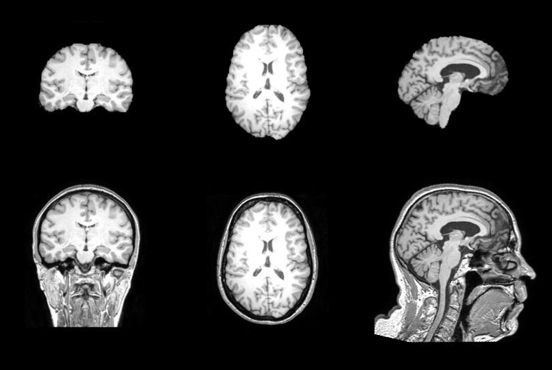

# EVC-Net: Multi-scale V-Net with Conditional Random Fields for Brain Extraction
EVC-Net is a supervised method for skulls stripping.

The model uses a novel deep learning architecture with CRFs to enhance the efficiency and accuracy of the algorithm.


This repo provides a python code for training and testing the model.

The main code can be found in src/models.py.

[Training example](examples/training_example.ipynb) and [Testing example](examples/testing_example.ipynb) are provided as an example of how to use the model.
***
## Required Packages
```
dipy
numpy
scikit-image
scipy
SimpleCRF
tensorflow
```

## Downloading
```
git clone git@github.com:pjsjongsung/EVC-Net.git
git lfs fetch
git lfs pull
```

## Simplest way to test
```
import src.models as models
import tensorflow as tf

model = tf.keras.models.load_model('trained_models/evnet/', custom_objects={'dice_coef': models.dice_coef})

# for directories
input_dir = 'where/the/nifti_files/are'
output_dir = 'where/the/output_files/should_be'
models.test_model(model, input_dir, output_dir, batch_size=1, model_type='evcnet', crf_param=None)

# or

# for individual file
input = 'path/to/nifti_file'
output = 'path/to/preferred/mask_location'
models.test_model(model, input, output, batch_size=1, model_type='evcnet', crf_param=None)
```
models.test_model puts the output masks of the brain in the specified output_dir.

***
## Some output examples

